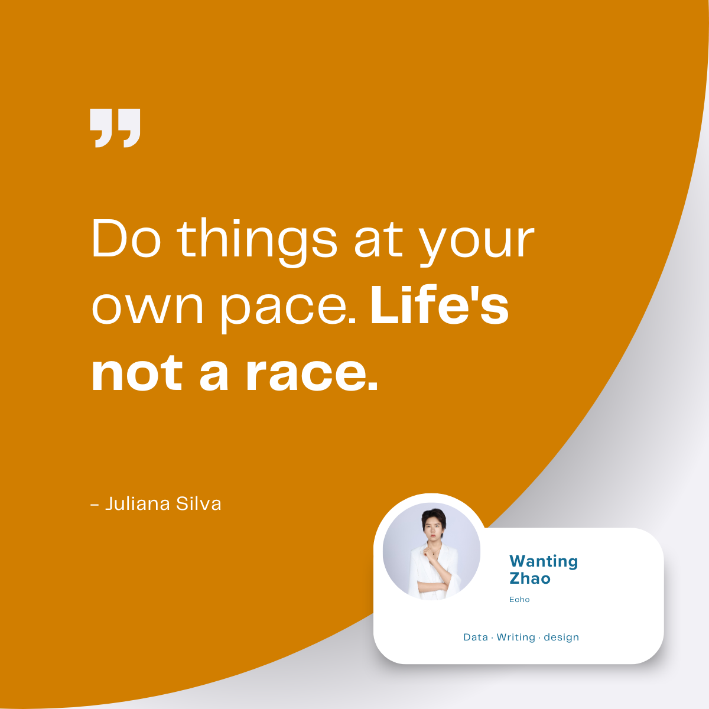

#  Echo's Personal Website 🧏🏼
## https://echozhao1998.github.io/

[**About**](#about) | [**Explore**](#explore) | [**Contact**](#contact)

<small>There is only one heroism in the world: to see the world as it is, and to love it.</small>

---

## About

Welcome to [Echo's personal website](https://echozhao1998.github.io/), a digital space where a small portion of thoughts, projects, and ideas are recorded and shared with the world. This site serves as a reflection of creativity and exploration, offering a glimpse into Ruida's imagination projected onto the digital realm. 

---

## Explore

- **News**: Stay updated with Echo's latest activities, tracking my growth!
  
- **Projects**: Explore Echo's endeavors and latest projects.

- **Blogs**: Delve into Echo's personal insights, covering topics from technology, DEI, self awareness.

Take a look around!

---

## Contact

For any inquiries or further information, please visit the [Contact](https://echozhao1998.github.io/contact.html) page. 
